# HoMie - Clothing Store Staff Portal

### Link

https://homie-portal-au.netlify.com/

### Github
https://github.com/HoMieDevs

## Description
The Homie Portal is a web application which allows our client to create staff rosters for their two locations, in store and office. Employees are able to log in, view their rosters as well as add upcoming unavailibilities.

## Problem
Our client currently had a very ineffective method to distributing rosters, as well as a way of keeping track of unavailibilities and shift swaps.

## Features

1. As you log in, the current user is taken to a page of all their own upcoming shifts
2. Rosters are visible week by week
3. There are two types of roles: admin and employees
4. Admin users are able to add and delete shifts. They are also given the ability to approve and reject unavailibility requests
5. Users are able to create their own profiles

## Tech Stack

- Mongoose
- Express
- React
- Node.js

## Developer notes

To run locally:
Create a .env file and put the following line in to ensure your code will work.

REACT_APP_API_URL="http://localhost:5000"

To deploy:
Make sure your .env file has been added to gitignore. 
You will be able to check it when you put git status in the terminal. If you can see the .env file in either red or green, it means it has not been git ignored. You have to do git reset .env

For the backend:
in api.js, make sure the following line is there, it will be on line 23
origin: "http://localhost:3000"

## Client Meeting

About HoMie:
- social enterprise
- open for 3 and half years
- dedicated to training/employment for youth (25 and under)
- once a month they close the store for homeless youth where they can shop for free with access to hairdressers and make up artists
- retail store is located in Brunswick Street

What they would like:
- simplify rostering
- four staff work full time
- about six staff work casually in the shop (1 or 2 days a week)
- during their vip days there could be volunteers
- keep track of who is working and where
- availabilities change week by week
- every 6 months they change staff over (when the training program restarts)
- rosters to be 2 or 3 weeks in advance
- able to upload staff user manual (need to be able to update policies and employee handbook)
- key agreement needs to be signed
- office staff have HoMie emails, shop staff have a number
- sign in for starting work (clock in and clock out)
- keep track of overtime - logging hours
- calculate total hours of work over the week
- feed on the home page - set up notifications - email
- select location when clock-ing on - map - where people are working (options - office/home/store) - geo location

- brand colours: black white and blue

Other information about business:
- social impact
- partnered services
- brochures about training programs
- apply to the vip days
- apply for internship - application forms - screening forms - interview with case workers

## Design process

Our client 'HoMie' had a branding style which we wished to use in our staff portal for them.
Colours were #FFFFFF, #000000 and #3CBCD7. We added #2727272 to add a more sleek and modern feel to the application.

Below are some screenshots from our Figma which displays our design drafts.

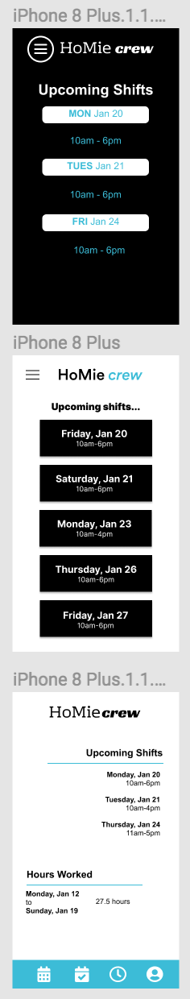

We ended up with a few too many choices...

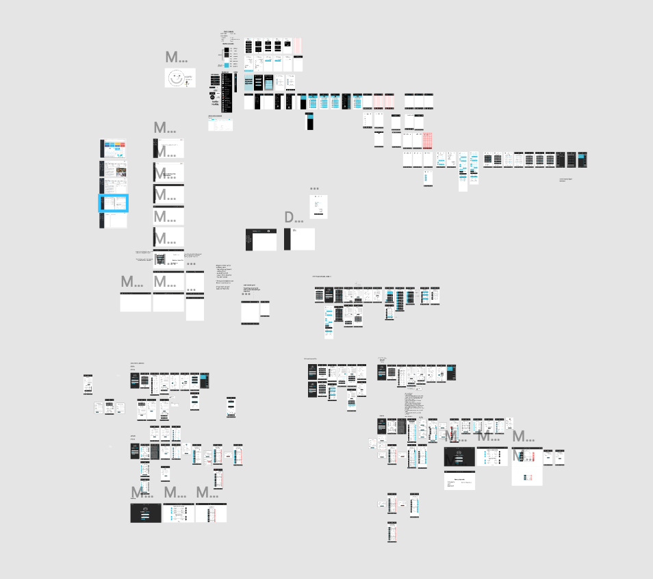

We agreed on the final design below.

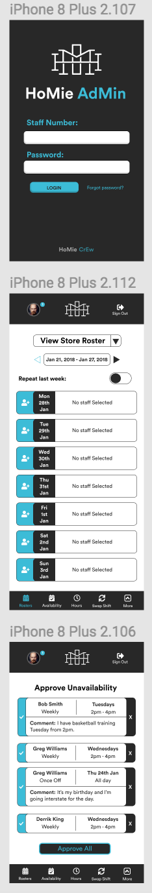

## User stories

User stories were written from client discussions as well as our own experiences using rostering systems.

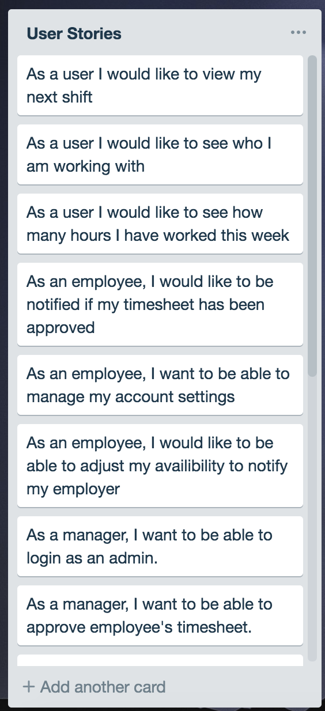
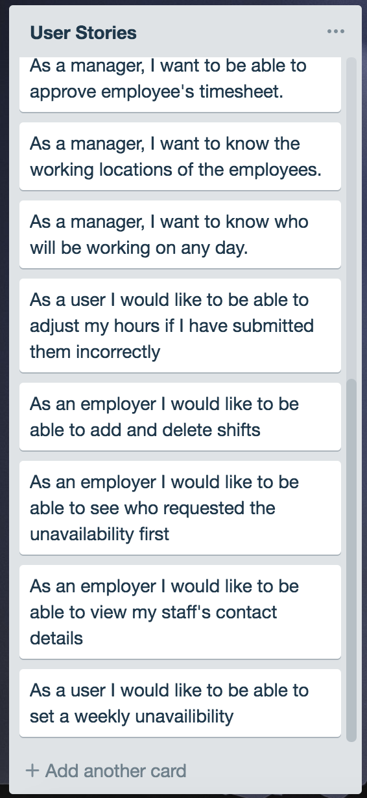

## Workflow

Our team spent the first three days making sure all plans were in place including design. We wanted to make sure had a clear vision of the final product.

Authorization and authentication was mastered as a team through mob programming. Once this was functioning that was when we split off working on different components whilst still helping each other out with errors.

We were fortunate that half our team were stong in backend and half our team had strengths in frontend.

## Complications

Our original MVP included functionality that allowed users to report their working hours and admin would be able to edit and approve those hours. An added feature of calculating weekly hours was a stretch goal.

Not too far into coding, we realised the complexity of all the features we were hoping to include and desided that reporting hours as a whole was going to be a stretch goal.

When connecting the front and back end together, this is where we found ourselves with the most errors. Having nested data in out schema meant it displaying and sending data became more complex.

## Wireframes

Once we had decided on an achievable (well what we thought was acievable) MVP, we drew up some very basic wireframes with what requests would be required.

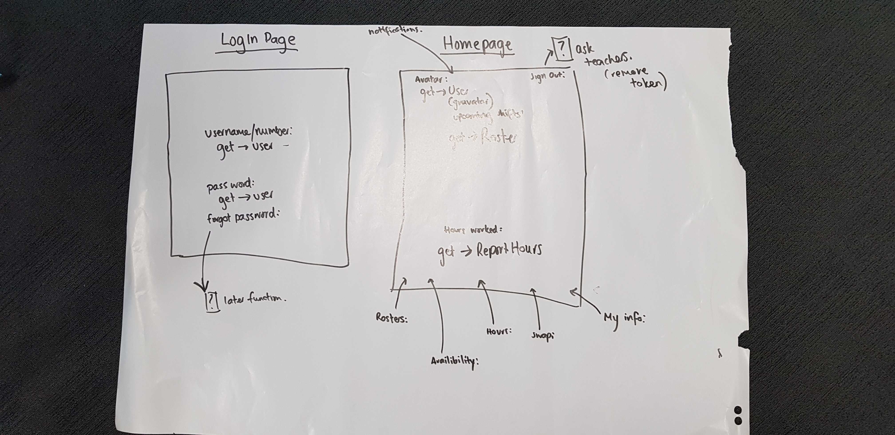
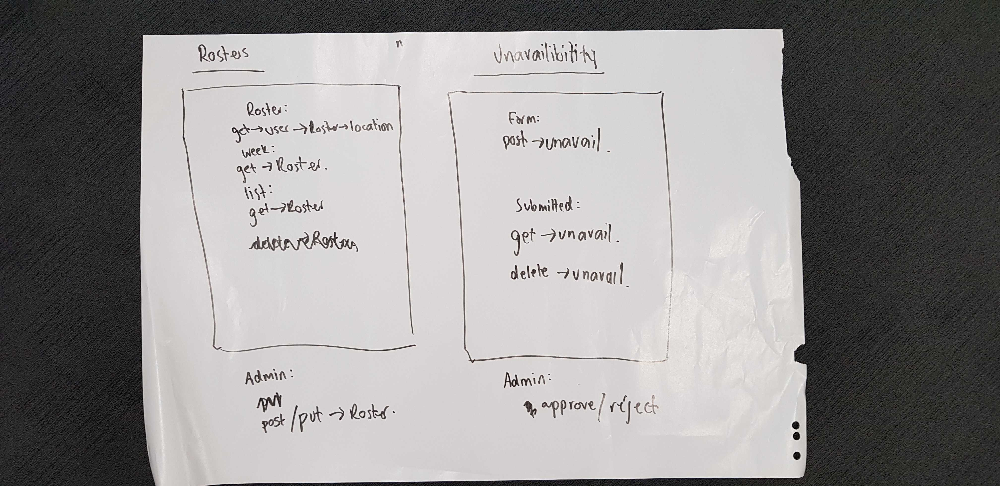
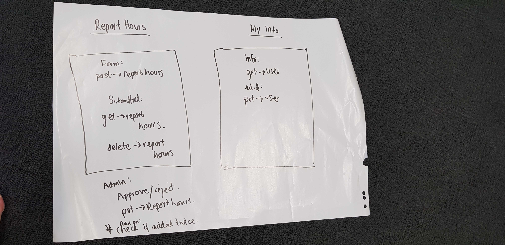

## Database Entity Relationship Diagrams

We had two schemas needed necessary to reach MVP.

**User**

const userSchema = new Schema({\
  firstName: {\
    type: String,\
    required: true\
  },\
  lastName: {\
    type: String,\
    required: true\
  },\
  admin:{\
    type: Boolean,\
    default: false\
  },\
  store:{\
    type: Boolean,\
    default: false\
  }, \
  office:{\
    type: Boolean,\
    default: false\
  },\
  email: {\
    type: String,\
    required: true,\
    unique: true\
  },\
  password: {\
    type: String,\
    required: true\
  },\
  mobile: String,\
  avatar: String,\
  unavailability: [{  \
    date: Date,\
    allDay: Boolean,\
    startTime: String,\
    endTime: String,\
    comment: String,\
    approved: {\
      type: Boolean,\
      default: false\
    }\
  }],\
  isDeleted: {\
    type: Boolean,\
    default: false\
  }\
});

**Roster**

const rosterSchema = new Schema({\
  date: Date,\
  location: String,\
  staff: [\
    {\
      staffMember: {\
        type: mongoose.Schema.Types.ObjectId,\
        ref: 'User'\
      },      \
      startTime: String,\
      endTime: String\
    }\
  ]\
});

## Project Management & Planning process 

Trello boards played a role in assisting us to set out tasks, however sometimes we found the old school way of writing it out on a large piece of paper or post-it notes!

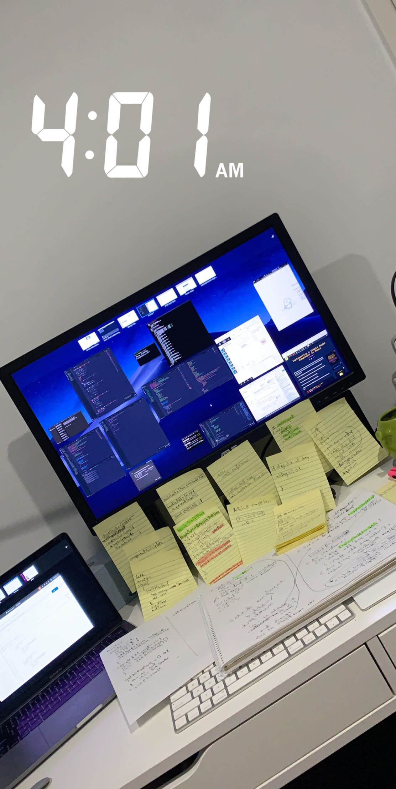
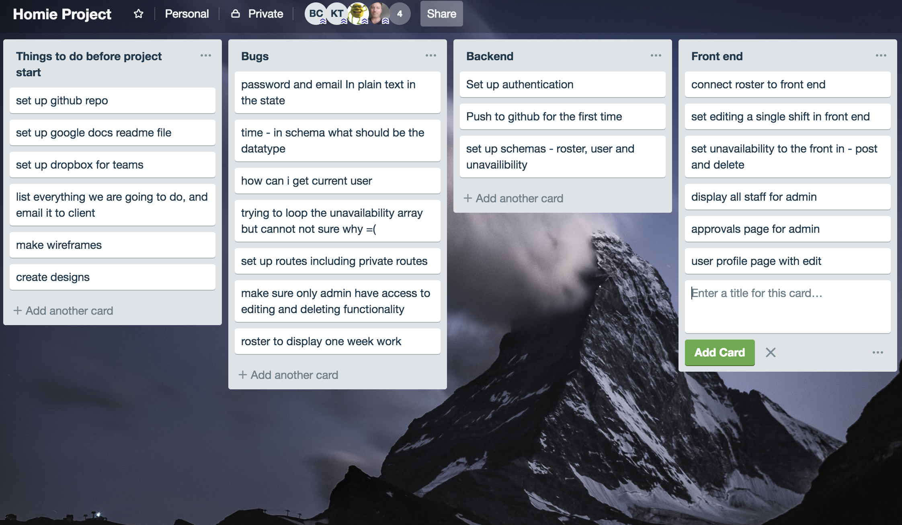
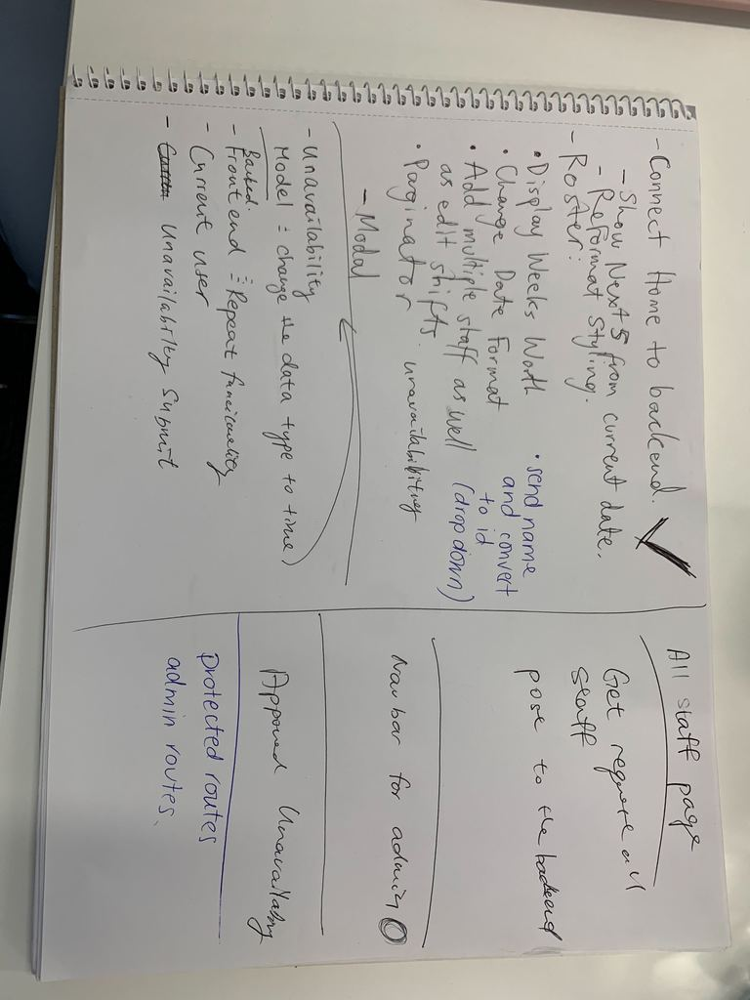

## Short Answer Questions

1. What are the most important aspects of quality software?
   
   Quality software can be described through many different aspects of the software, such as useability, functionality, scalability and many more.

   In today's society, one of the most important aspects of quality software would be security. We rely so heavily on technology that it holds the key to much of our personal information. To ensure the highest security, you must be sure to implement authorisation and authentication whilst understanding all entery points to your routes, as well as making sure to have data encryption.

   Another important aspect of software quality is useability. With technology ever evolving, we are becoming increasingly impatient. If a software is too difficult to use we will simply stop using it as the chances are you will be able to find another piece of software with similar functionality. 

2. What libraries are being used in the app and why?
   
   - Moment: This package was used to assist with displaying, entering and formatting time
   - Axios: Axios was implemented in order to send requests to the backend to then interact with the database

3. A team is about to engage in a project, developing a website for a small business. What knowledge and skills would they need in order to develop the project?
   
   Key to ensuring software quality, you must truley understand the ins and outs of the users and their needs. Gaining a deeper understanding of how the business is run will allow you to create a software that meets and hopefully exceeds the business's needs. Without a deep understanding you can jeopardise the user experience.

    Apart from the obviously coding skills you will need, you must also be able to manage expectations. In software development it is common for many unexpected delays. Using an effective manner to manage the clients expectations on time and deliver is essential.

   
4. Within your own project what knowledge or skills were required to complete your project, and overcome challenges?
   
   Aside from the obvious coding skills we needed to build a web app using the MERN stack, there were also many other skills neccessary to complete this project.

   Number one, make or break skill would be how to work most effectively in a team. You are in a group with many skilled and creative individuals. Each individual has their own strengths and weaknesses and you must be able to understand what these are to best complement the skills of other team members. 

   In our particular project (scheduling system), we needed to have a deeper understanding and knowledge of the needs of the user, both admin and employees.

   The biggest challenges stemmed from understanding the best way to write our schemas. To know the most effective use of our schemas, we had to understand where and how we wanted to interact with the database.
   
5. Evaluate how effective your knowledge and skills were this project, using examples, and suggest changes or improvements for future projects of a similar nature?
   
   In the beginning of this project we all had a very basic level of knowledge in the MERN stack. Throughout the project and encountering many errors and issues we have learnt a lot and have a much fuller understanding. 

   Overall, our team worked really well together. Our strengths complemented others weaknesses and vice versa. An area that could be improved would be communication. At points we realised we had actually doubled up on some components and could have used our time more effectively.

   At the start, we would write down daily goals. As time went one, this became a little less important and we would just continue on with whichever component it was we worked on. Perhaps if we kept to doing this, we may have had better time management.

